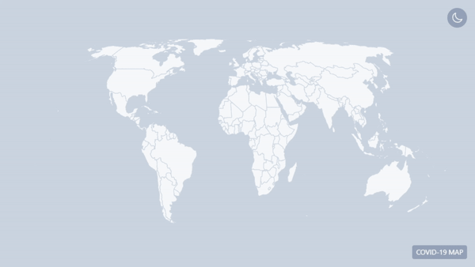

<div align="center" id="top"> 
  <picture>
       <source media="(prefers-color-scheme: dark)" srcset="./.github/assets/preview-dark.gif" >
       <source media="(prefers-color-scheme: light)" srcset="./.github/assets/preview-light.gif" >
       
  </picture>
&#xa0;

  <!-- <a href="https://covid19map.netlify.app">Demo</a> -->
</div>

<h1 align="center">Covid 19 Map</h1>

<p align="center">
  

  

  

  
</p>

<p align="center">
  <a href="#dart-about">About</a> &#xa0; | &#xa0; 
  <a href="#sparkles-features">Features</a> &#xa0; | &#xa0;
  <a href="#rocket-technologies">Technologies</a> &#xa0; | &#xa0;
  <a href="#white_check_mark-requirements">Requirements</a> &#xa0; | &#xa0;
  <a href="#checkered_flag-starting">Starting</a> &#xa0; | &#xa0;
  <a href="#memo-license">License</a> &#xa0; | &#xa0;
  <a href="https://github.com/emrebal98" target="_blank">Author</a>
</p>

<br>

## :dart: About

The project is about covid-19 statistics. It has a world map with selectable country. According to selected country it shows the statistics of that country.

## :sparkles: Features

:heavy_check_mark: Zoomable world map;\
:heavy_check_mark: Responsive app;\
:heavy_check_mark: Dark and light mode;

## :rocket: Technologies

The following tools were used in this project:

- [React](https://reactjs.org/)
- [Vite](https://vitejs.dev/)
- [Redux](https://redux.js.org/)
- [Redux-Saga](https://redux-saga.js.org/)
- [TypeScript](https://www.typescriptlang.org/)
- [TailwindCSS](https://tailwindcss.com/)

## :white_check_mark: Requirements

Before starting :checkered_flag:, you need to have [Git](https://git-scm.com) and [Node](https://nodejs.org/en/) installed.

## :checkered_flag: Starting

```bash
# Clone this project
$ git clone https://github.com/emrebal98/covid-19-map

# Access
$ cd covid-19-map

# Create .env file
$ cp .env.example .env # my api key 0149c2504fmsh35ef993c1d85b20p1cfc3djsn7a789e7e7b06

# Build the Dockerfile
$ docker build -t covid-map .

# Run the Docker Container
$ docker run -d --rm -p 8080:8080 --name covid-map-container covid-map

# The server will initialize in the <http://localhost:8080>
```

## :memo: License

This project is under license from MIT. For more details, see the [LICENSE](LICENSE.md) file.

Made with :heart: by <a href="https://github.com/emrebal98" target="_blank">Emre Bal</a>

&#xa0;

<a href="#top">Back to top</a>
